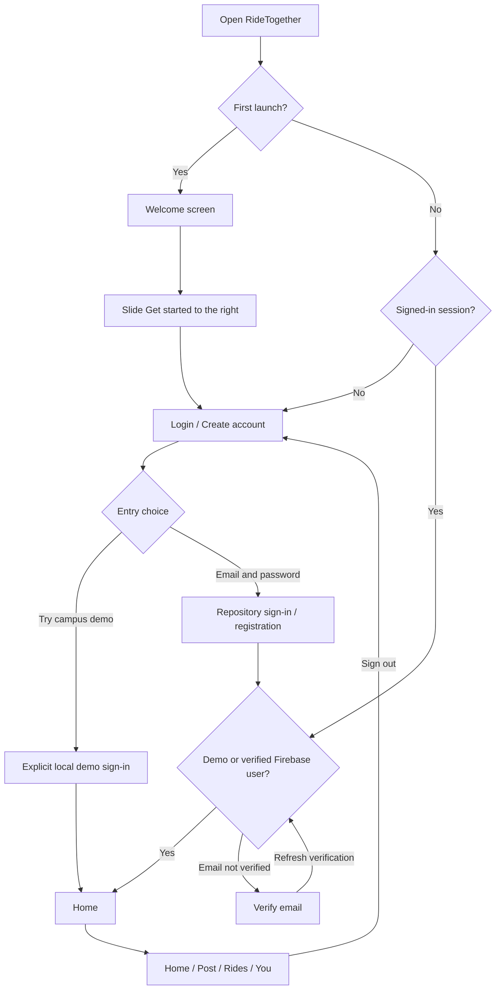
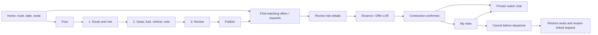
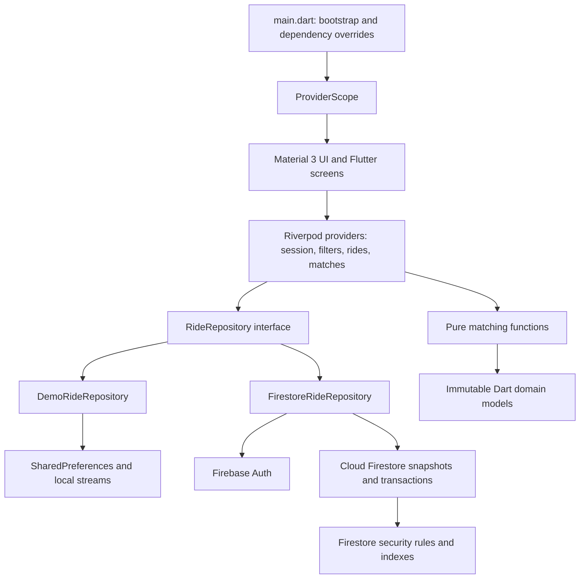
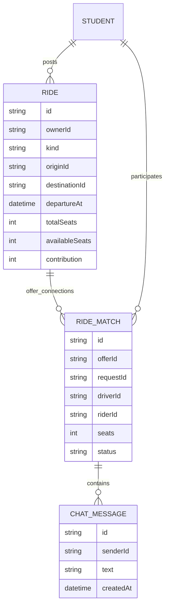
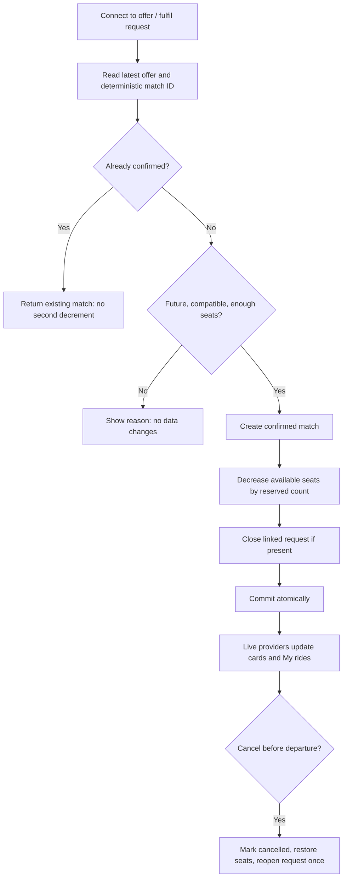

# RideTogether

### A campus carpool app built with Flutter, Riverpod and Firebase

RideTogether helps students **offer spare seats or request a lift** between campus-area locations. Instead of treating every journey as a taxi booking, it connects people travelling along the **same route, on the same day**, with enough seats for the whole request.

The app has a mobile-first, black-and-white interface with **editorial character illustrations**, bundled SVG icons and Manrope typography. It is a real Dart/Flutter application created from `flutter create`—not an HTML imitation.

The latest artwork update is based on user commit `62bd6c3` (package upgrade). Its package-lock versions and analyzer exclusions are preserved.

**Current development target:** Chrome with `flutter run -d chrome`. Android source is retained, but APK generation is not part of the current workflow.

---

## Contents

1. [Run the app](#run-the-app)
2. [What the application does](#what-the-application-does)
3. [How the app flows](#how-the-app-flows)
4. [Driver and rider journeys](#driver-and-rider-journeys)
5. [Screens and navigation](#screens-and-navigation)
6. [Architecture](#architecture)
7. [File-by-file guide](#file-by-file-guide)
8. [Data and reservations](#data-and-reservations)
9. [Demo versus Firebase](#demo-versus-firebase)
10. [Images and responsive layout](#images-and-responsive-layout)
11. [Testing](#testing)
12. [Known boundaries](#known-boundaries)

## Run the app

### Requirements

- Flutter stable; tested with **Flutter 3.47.5 / Dart 3.13.4**.
- Chrome.
- Internet access for the initial dependency download. The local demo itself needs no Firebase project.

```bash
git clone https://github.com/Tejas-Solanki3/RideTogether.git
cd RideTogether
flutter pub get
flutter run -d chrome
```

If you downloaded the source archive, enter its `ride_together` folder instead.

Useful development commands:

```bash
flutter doctor
flutter devices
flutter analyze
flutter test --concurrency=1
```

Use `r` in the Flutter terminal for hot reload and `R` for hot restart. There is no need to install Android SDK or run Gradle to work on the Chrome UI.

## What the application does

| Action | What happens |
|---|---|
| Offer a ride | A driver posts pickup, destination, departure, available seats, vehicle and suggested fuel contribution. |
| Request a ride | A rider posts the same journey information and the number of seats needed. |
| Find a connection | The list filters live posts by directional route, day, capacity and optional preferences. |
| Reserve seats | A rider joins an offer directly or connects their own request; a driver can fulfil a compatible request. |
| Coordinate pickup | Both participants see the connection under **Rides** and use private match chat. |
| Cancel before departure | Reserved seats return to the offer; a linked request reopens. |

Fuel amounts are **suggested contributions**, not an in-app payment transaction. The app does not have a wallet, collect fares or provide taxi dispatch.

## How the app flows

### Entry and authentication



The welcome slider saves **onboarding completion only**. It never signs a student in. A short swipe resets the handle; a completed swipe opens login. A screen reader has an equivalent activation action.

Fresh demo installations are signed out. Returning sessions persist only after explicit sign-in. To repeat first-launch onboarding in Chrome, clear this app's browser storage or use a fresh browser profile. **Reset local demo** clears demo data and signs out, but does not reset the welcome preference.

### Main journey



## Driver and rider journeys

### Rider: join directly

1. Sign in and select **I’m riding** on Home.
2. Choose pickup, destination, date and passenger count.
3. Select **Find a ride**, review an offer, and reserve a seat.
4. Read the confirmation, open chat and agree on the exact pickup spot.
5. The connection appears in **Rides → Connections** as **Riding**.

### Rider: fulfil a multi-seat request

1. Open **Post** and choose **I need a ride**.
2. Set the requested seats, review and publish.
3. Choose **Find compatible rides**.
4. The offer details preselect your posted request.
5. Reserving connects the whole request, decreases the offer's seats by that count, and marks the request matched.

### Driver: fulfil a request

1. Post an offer with a vehicle description and available seats.
2. Choose **Find compatible requests**, or select **I’m driving** on Home.
3. Open a request and select one of your compatible offers.
4. Choose **Offer a lift**. All requested seats are reserved together.
5. The connection appears as **Driving** under Rides.

## Screens and navigation

| Screen | Purpose |
|---|---|
| Welcome | Unboxed community illustration, benefits, responsive layout and genuine swipe-to-start control. |
| Login / Create account | Validated credentials, password visibility, reset-password action and explicit demo entry. |
| Verify email | Blocks unverified Firebase accounts from campus data until verification is refreshed. |
| Home | Greeting, destination picker, rider/driver intent, route, date, passenger count and search. |
| Find | Live offer/request cards, save filter, minimum seats, free-only preference, time window and sorting. |
| Post | Three-step validated form with visible Route → Details → Review progress. |
| Ride details | Live availability, pickup note and direct/request-linked reservation choice. |
| Confirmation | States the reserved seats and counterpart; offers chat or My rides. |
| Rides | Connections, own posts, upcoming/past/cancelled sections and role filtering. |
| Connection details | Reservation information, chat access and cancellation. |
| Chat | Participant conversation, pickup quick replies and a read-only state after cancellation. |
| You / Profile | Account details, campus/safety/data information, demo reset and sign-out. |

The floating navigation capsule contains **Home / Post / Rides / You**. Detail and chat pages use Flutter routes. Wide Chrome windows show the same mobile app canvas, not a desktop dashboard.

## Architecture



The UI talks to a repository abstraction, not directly to Firestore. The demo and production adapters expose the same operations. Riverpod derives matching lists from live snapshots, session state and filters. A minute clock removes departed offers from search without requiring a database edit.

## File-by-file guide

### Bootstrap, models and state

| File | Contains |
|---|---|
| `lib/main.dart` | Initializes preferences and optional Firebase, chooses the repository, injects ProviderScope, builds the themed Flutter app. |
| `lib/config/firebase_config.dart` | Public Firebase client options from Dart defines; defaults to demo mode. |
| `lib/domain/models.dart` | `Student`, `CampusPlace`, `Ride`, `RideMatch`, `ChatMessage`, filters/enums, JSON mapping and date helpers. **`Student.demo` selects `aarav.jpg` for the sample profile.** |
| `lib/domain/matching.dart` | Pure directional route/day filtering, sorting, request compatibility and post validation. |
| `lib/state/providers.dart` | Session/live streams, matching state, filters, bookmarks, navigation, request context, minute clock and onboarding preference. |

### Data layer

| File | Contains |
|---|---|
| `lib/data/ride_repository.dart` | Contract for auth, posts, matches, reservations, cancellation, chat and demo reset. |
| `lib/data/demo_repository.dart` | Seeded sample campus, persistent local state, serialized mutations, rollback, explicit demo sign-in and saved-session migration. |
| `lib/data/firestore_repository.dart` | Firebase Auth adapter, live queries, server timestamps and multi-document reservation/cancellation transactions. |

### Flutter UI

| File | Contains |
|---|---|
| `lib/ui/theme.dart` | Material 3 colors, Manrope typography, form styling, buttons, dialogs and sheets. |
| `lib/ui/shell.dart` | Welcome/login/verification gates and the Home/Post/Rides/You navigation shell. |
| `lib/ui/screens/onboarding.dart` | Welcome hero, wrapping benefits, compact-window scrolling and `SwipeToStart`. |
| `lib/ui/screens/login.dart` | Login, registration, password reset and email-verification screens. |
| `lib/ui/screens/home.dart` | Route/date/seat selection, rider/driver intent, search and in-app updates. |
| `lib/ui/screens/find_ride.dart` | Matching `ListView`, role tabs, filters, sorting and empty/error states. |
| `lib/ui/screens/post_ride.dart` | Route → Details → Review form, publication and compatible-match search. |
| `lib/ui/screens/ride_details.dart` | Ride/request details, reservation, confirmation and connection cancellation. |
| `lib/ui/screens/my_matches.dart` | Own posts and driver/rider connections grouped by status/time. |
| `lib/ui/screens/chat.dart` | Message stream, composer, quick replies and cancelled-conversation handling. |
| `lib/ui/screens/profile.dart` | Account/campus information, safety/privacy sheets, local reset and sign-out. |
| `lib/ui/widgets/common.dart` | Shared SVG icons, illustrated avatars, surfaces, buttons, route summaries, pickers and error messages. |
| `lib/ui/widgets/ride_card.dart` | Reusable ride cards showing owner, route, date/time, seats, suggested fuel and bookmark action. |
| `lib/ui/widgets/route_map.dart` | Original grayscale illustrative campus map drawn in Dart; not GPS navigation. |

### Assets, backend configuration and tests

| Path | Purpose |
|---|---|
| `assets/illustrations/` | Coordinated community, shared-ride, route-search and connection artwork with transparent backgrounds. |
| `assets/avatars/aarav.jpg` | Illustrated demo profile portrait; the filename and demo account identity are retained. |
| `assets/icons/` | Bundled Lucide SVG icon family and its license. |
| `assets/fonts/` | Manrope variable font and OFL license. |
| `assets/svg/logo.svg` | Original monochrome RideTogether branding. |
| `web/index.html` | Tiny Flutter Chrome bootstrap only; Flutter owns the viewport configuration. |
| `web/manifest.json`, `web/icons/` | Browser app identity and icons. |
| `android/` | Retained native project source; not required for the Chrome workflow. |
| `firestore.rules` | Verified-member access, schema/ownership validation, atomic seat invariants and participant privacy. |
| `firestore.indexes.json` | Campus-ride and participant-match query indexes. |
| `firebase.json` | Firestore/emulator configuration; no separate website hosting setup. |
| `config/firebase.*.example.json` | Placeholder public client configuration for Chrome or future Android use. |
| `test/matching_test.dart` | Model and pure matching/sorting tests. |
| `test/demo_repository_test.dart` | Auth/session, persistence, reservations, cancellation, chat and migration tests. |
| `test/widget_test.dart` | Actual Flutter screen journeys, swipe behaviour and responsive-layout regression tests. |
| `firebase_tests/rules.test.mjs` | Firestore Emulator security/transaction/privacy assertions, not website UI. |
| `docs/` | Firebase setup, architecture/design rationale, asset provenance, QA and browser screenshots. |

## Data and reservations

### Stored records



`Student` is an app/auth model; the current backend does **not** require a separate Firestore `students` collection. Public ride records include a display-name snapshot and owner ID, not email addresses or phone numbers.

### Reservation rule



- A direct rider join reserves **one seat**.
- A rider's own request or driver fulfilment reserves **all requested seats**.
- Requests and offers must share campus, ordered endpoints, departure day and be within **60 minutes**.
- Seat counts are checked against the latest data, not a stale card.
- Match ID is `offerId_riderId`; duplicate confirmed joins do not consume another seat.
- A cancelled connection cannot be recreated on the same offer.
- Cancellation keeps history/chat and returns seats exactly once.

The demo serializes changes within one app instance and persists them locally. Firestore enforces multi-client atomicity with transactions and `getAfter()` security-rule checks. The demo does not synchronize different browsers/devices.

## Demo versus Firebase

| | Local demo, default | Firebase mode |
|---|---|---|
| Configuration | None | Your public client config |
| Authentication | Explicit local simulation; no real password | Firebase Email/Password and verification |
| Persistence | Current browser/device | Cloud Firestore |
| Multiple devices | Not synchronized | Live snapshots |
| Other person online | No | Only when another real account is connected |
| Demo profile | Ishaan Mehta, using `aarav.jpg` | User display information |
| Sample campus | Fictional Greenfield University | Replace with your institution |

```bash
cp config/firebase.web.example.json config/firebase.web.json
# Fill YOUR public Web app values, then:
flutter run -d chrome --dart-define-from-file=config/firebase.web.json
```

See [Firebase setup](docs/FIREBASE_SETUP.md). Do not commit service accounts, private keys or filled local configuration. The public Firebase API key is not a database password; Auth/rules enforce access.

## Images and responsive layout

- Editorial illustrations replace all photographs. Warm ochre, terracotta and pale teal artwork sits beside restrained black/white/grey controls.
- Welcome art has a transparent background and is rendered directly on the white page: **no rounded frame, border, backdrop, or photo-label overlay**.
- Matching illustration scenes appear in login, Home, posting, confirmations, empty states and chat; all bundled profile portraits are illustrated too.
- Demo avatar is `assets/avatars/aarav.jpg`; changing the profile picture does not change the sample account's ID/name.
- Existing saved canonical demo sessions normalize to the current demo image.
- Onboarding benefits use **Wrap**, not an inflexible one-line Row.
- Narrow/short browser windows can scroll onboarding rather than clipping or overflowing.
- Header decoration adapts to the available width. Flutter manages its own Chrome viewport; the bootstrap does not duplicate the viewport meta tag.
- Bulky embedded HTML design exports are not included. App UI and matching logic remain Dart.

## Testing

```bash
flutter analyze
flutter test --concurrency=1
```

Tests cover model mapping, directional route/day matching, capacity, time preference, idempotent joins, group reservations, cancellation, privacy boundaries, persistence, login-first entry, short/complete swipes and the reported narrow onboarding layout.

Firestore security suite (separate from the Chrome UI workflow; Node 20+ and Java 21+):

```bash
cd firebase_tests
npm ci
npm run emulator
```

See [QA details](docs/QA.md) for current verification results. Browser screenshots under `docs/screenshots/` are captured from the running Flutter app, not HTML mockups.

## Known boundaries

- No production Firebase project is configured in the default demo.
- Verified email alone is not verified student membership; add campus-domain restrictions or administrator-issued claims before launch.
- Matching uses device-local dates/time. A real cross-timezone deployment needs an explicit campus timezone.
- The custom map is illustrative, not navigation or live tracking.
- No wallet, payments, push notifications, driving-licence verification or emergency service is implied.
- Real deployment needs moderation, retention/account deletion and campus transportation/privacy policy review.

Asset provenance and licenses: [docs/ASSETS.md](docs/ASSETS.md).
